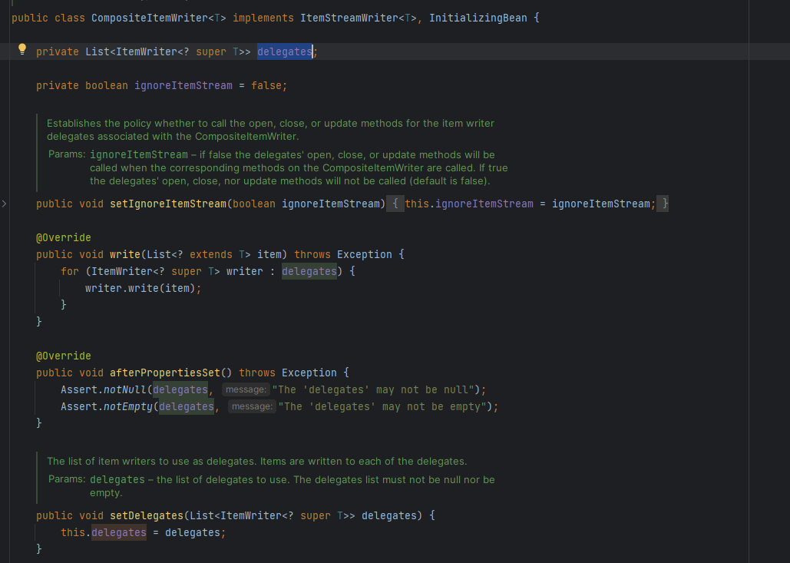
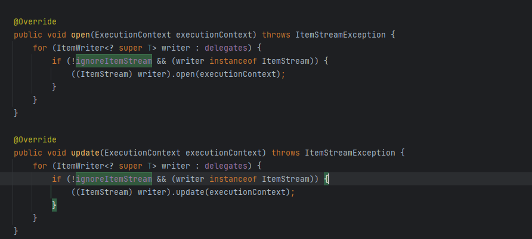

## Spring Batch Study
요즘 업무를 하면서 제일 많이 개발을 하고 있는 것이 스프링 배치 입니다. 그래서 스프링 배치를 공부를 좀 더 하기 위해서 개인적으로 스터디 프로젝트를 목적으로 시작하였습니다.

## CompositeItemWriter
 - 회사 업무에서, 타부서에 전송을 하는 파일을 또 다른 타 부서로 전송을 해야하는 업무가 생겼습니다.
    - 요구사항
        - 현재 회사의 개발환경은 디비가 10개로 샤딩이 되어 있으며, 각 DB의 해당 테이블의 데이터들을 총 10개의 파일을 만들어서 타 부서로 보내고 있는데, 신규 타부서 송신 파일은 각 10개의 파일을 하나로 합쳐서 보내야함(파일의 구분자, 인코딩 다름)
        - 하나의 파일은 만들려고, 노력을 했지만, 현재 배치가 어제 날짜 기준으로 모든 데이터를 전송하는 배치라서, 데이터가 계속 증가하는 테이블이라서 배치 속도가 중요해서 현재 parallel step으로 병렬 수행, 그래서 하나의 파일을 만들 때, 서로 thread 끼리 충돌하는 문제가 발생하여 에러 발생. 그래서 후행 작업으로 shell을 통해서 하나의 파일로 만들어서, 타부서로 전송하도록 로직 추가 하였음
        - 다른 파일을 만들기 위해서, 동일한 쿼리를 동일하게 다시 수행해서, 파일을 만드는 방법은 굉장히 이상한 방법이기 때문에 구글링 한 결과, CompositeItemWriter 를 통해서 writer를 여러개 사용할 수 있는 부분을 확인하여 해당 부분 테스트 하기 위해서 사용

CompositeItemWriter 클래스안에서 delegates 필드는 ItemWriter를 list로 가지고 있음

CompositeItemWriter setDelegates 메서드를 통해서, ItemWriter들을 set 해주면, writer를 할 때, 해당 list 들을 순회하면서, 사용

## AsyncItemProcessor, AsyncItemWriter
 - 신규 업무 중, 타 부서에서 해당 고객 정보를 파일로 받아서, 특정 금액 이상인 사용자들만 다시 타 부서로 다시 파일로 전달을 해줘야 하는 업무를 받았다
 - 문제 사항
   - 타부서에서 받는 고객정보는 샤딩 테이블의 샤딩 키가 아니다.... 그래서 고객 정보 테이블을 다시 한번 뒤져야 한다....
   - 금액을 확인할 수 있는 테이블을 다시 조회를 해서 특정 금액 이상인 사용자만 다시 파일로 만들어야 한다
 - 현재 생각을 했을 때, 파일을 읽어오기(FlatFileItemReader), 고객 정보 테이블 조회 및 금액 확인하여 필터(Processor), 파일 생성(FlatFileItemWriter) 이란 방식으로 먼저 생각을 해보고 퇴근 후 조금 해보았다
 - 먼저 AsyncItemProcessor, AsyncItemWriter 사용 할려면, gradle에 implementation 'org.springframework.batch:spring-batch-integration' 추가를 해줘야 한다
 - AsyncItemProcessor, AsyncItemWriter 이거는 둘이 함께 구성되어야 한다 
 - AsyncItemProcessor로 부터 AsyncItemWriter 가 받는 최종 값은 List<Future<T>> 타입이며 비동기 실행이 완료 될때까지 대기 